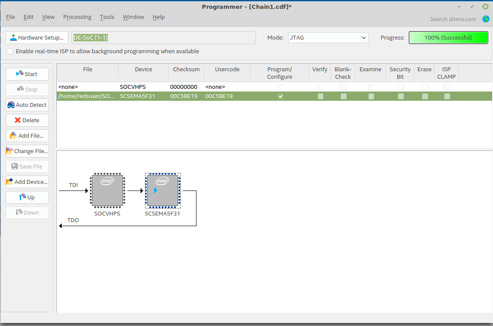
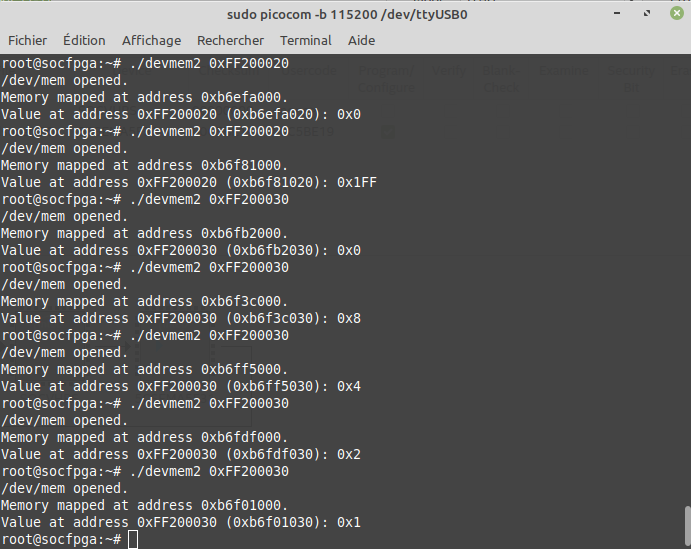

# SOCF Laboratoire 3 : Porter Linux sur la DE-1
##### Auteur : Pierrick Muller

## Génération de la carte SD
J'ai commencé par télécharger l'image `DE1_SoC_SD.img`.
Par la suite ,j'ai contrôlé avec la commande lsblk si le périphérique était le bon, puis j'ai utilisé la commande `sudo dd bs=4M if=DE1_SoC_SD.img of=/dev/sdb status=progress conv=fsync`.

## Compilation de Linux
Je disposais déja du repo Linux sur mon ordinateur. Je l'ai mis à jour depuis github, puis j'ai utilisé les commandes qui nous étaient fournies avec comme remplacement :
`<TOOLCHAIN_DIR>` = `/opt/gcc-linaro-arm-linux-gnueabihf-4.7-2013.01-20130125_linux/`
Tous c'est passé sans erreur.

## Création du device tree
J'ai trouvé le device tree de la DE-0 :

`arch/arm/boot/dts/socfpga_cyclone5_de0_nano_soc.dts`

Je l'ai copié sous le nom suivant :

`arch/arm/boot/dts/socfpga_cyclone5_de1.dts`

Concernant les dtsi, le fichier en incluait un, qui en incluait un lui-même. Nous avions donc les deux fichiers suivants en plus :

```
arch/arm/boot/dts/socfpga_cyclone5.dtsi
arch/arm/boot/dts/socfpga.dtsi
```

J'ai par la suite supprimé les noeuds qui étaient demandés, puis j'ai cherché ou modifier l'adresse de base du bridge lightweigh.
Au cours de mes recherches, j'ai finalement trouvé dans le fichier socfpga.dtsi l'endroit ou la modification devait être effectué, et je l'ai modifié comme ceci :
```
fpga_bridge0: fpga_bridge@ff200000 {
  compatible = "altr,socfpga-lwhps2fpga-bridge";
  reg = <0xff400000 0x100000>;
  resets = <&rst LWHPS2FPGA_RESET>;
  clocks = <&l4_main_clk>;
};
```
J'ai ensuite pu compiler le device tree avec la commande fournie. J'ai déplacé le dtb obtenu sur la carte en le renommant avec le nom du dtb qui était déja sur la carte.
## Test du bridge HPS <-> FPGA
J'ai pu démarrer la carte et observer à l'aide de dmesg que les bridges étaient correctement initialisés (voir kernel.log).

Pour le test final, j'ai récupéré le programme que j'ai cross-compilé à l'aide de la commande `arm-linux-gnueabihf-gcc -o devmem2 devmem2.c`. J'ai déplacé l'exécutable obtenu dans le dossier `/home/root` de la carte.

J'ai pu par la suite charger le bitstream sur la carte comme le montre l'image ci-dessous :


Finalement, j'ai pu tester le programme fournit afin de vérifier son fonctionnement à l'aide de la séquence suivante:
- Lecture switchs, all down
- Lecture switchs, all up
- Lecture keys, all down
- Lecture keys, key 3 actif
- Lecture keys, key 2 actif
- Lecture keys, key 1 actif
- Lecture keys, key 0 actif




Le résultat obtenu montre le fonctionnement du bridge lwhps2fpga. Il est intéressant de noter que le switch 9 allume ou éteint une LED en fonction de son état, et ne peut pas être lu. Je pense que cela vient du bitstream.

## Conclusion
Ce laboratoire nous a permis de mettre en place notre environnement Linux sur la carte DE1-SoC. Il s'agissait principalement d'une marche à suivre permettant d'atteindre l'objectif voulu, tout en permettant de se remettre en tête certaines notions (dts, cross compilation...). 
