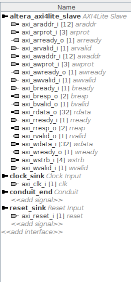
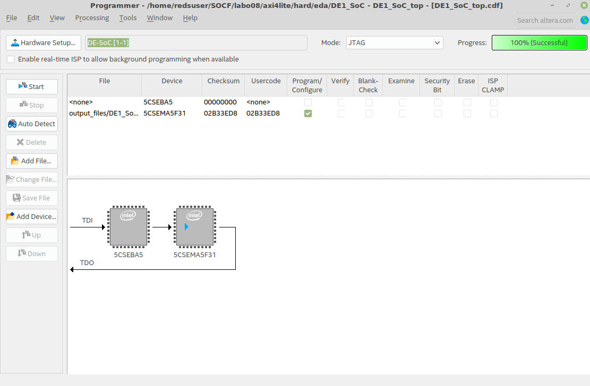

# Laboratoire 8 : Implémentation de l’algorithme de hachage MD5

#### Auteur : Pierrick Muller

## Introduction
### Objectif
Réaliser votre première conception d’un système réel.
### Description
MD5 est un algorithme classique de hachage utilisé dans de nombreuses applications. Le  but  est  de  réaliser  une  implémentation  FPGA  pour  accélérer  le  calcul  de  cet  algorithme. Votre application doit pouvoir calculer le hash de n'importe quel fichier.

Si vous avez une implémentation software du MD5, vous pouvez taper :
```
#./md5 mon_fichier
```
Vous obtenez comme résultat un hash de 128b bits.  

- exemple : 595F44fec1e92a71d3e9e77456ba80d1

Votre  objectif  est  de  créer  un  device  (et  son  driver)  de  telle  manière  que  l’on  puisse  l’exécuter sur linux.
```
#cat mon_fichier > /dev/votre_device_MD5
```
suivi de
```
#cat /dev/votre_device_MD5
```
et de récupérer le hash :
- 595F44fec1e92a71d3e9e77456ba80d1

Pour  vous  simplifier  la  réalisation  de  ce  laboratoire,  nous  vous  fournissons  une  IP  de  l'algorithme MD5 permettant de l'implémenter dans la partie FPGA du SoC. L'IP fournie permet de calculer le hash pour un bloc de 512 bits.
### Références
Différentes  implémentations  logicielles  peuvent  être  trouvées  sur  internet,  comme  par  exemple sur le site  https://rosettacode.org/wiki/MD5 qui dispose d’un vaste catalogue d’implémentation.

Sur l’algorithme en lui-même, il y a également beaucoup de documentation. Wikipedia est  un  point  de  départ  très  utile  https://en.wikipedia.org/wiki/MD5;  si  vous  voulez  tout  savoir sur l’algorithme, le standard est disponible sur  https://tools.ietf.org/html/rfc1321.  

N’hésitez  pas  à  discuter  de  vos  idées  d’architectures  et  de  développement  avec  nous  avant  de  les  implémenter  !  Votre  temps  est  limité  et  nous  pouvons  éviter  des  erreurs  classiques.

## Analyse
En réfléchissant au problème, j'ai choisi de partir sur un système comprenant plusieurs registres permettant de gérer beaucoup de chose du coté du driver qu'il faudra fournir par la suite. En effet, au vu du manque de temps mis à disposition pour réaliser le laboratoire, j'ai choisi cette technique pouvant parraître moins élégante car nécéssitant plus d'action du coté du developpeur du driver et n'automatisant pas tout car c'étais la façons la plus "Simple".

J'ai donc du définir plusieurs registres et signaux qui permettraient le fonctionnement correct du système. Voici ces sigaux et registres(Le plan d'adressage précis est disponible dans la suite de ce document)  :
- data_md5 : Registre permettant d'écrire les données qui doivent être transformées, 32 bits par 32 bits. De plus, c'est dans ce registre que l'on peut récupérer le footprint en effectuant 4 lectures (32*4 = 128 bits, soit la taille du footprint).
- start_md5_work : Ce signal doit être mis à 1 lorsque l'on commence à traiter un fichier, et remis à 0 une fois le fichier traité.
- md5_work_done : Ce signal passe à 1 une fois le traitement d'un bloc de 512 effectué. Ainsi, on peut attendre sur lui pour s'assurer que le résultat est valide. Il doit être réinitialisé à 0 une fois qu'il est passé à 1.
- start_md5_block : Ce signal lui doit être passé à 1 une fois que l'on souhaite traiter un bloc. Par la suite, il doit être réinitialisé manuellement.

La création de ces différents registres et signaux s'est faite lors de la réféxion sur l'implémentation qui devait être mise en place. Voici l'"Algorithme" qui à été choisit pour ce laboratoire :

##### Ecriture
- On met start_md5_work à 1 pour dire qu'on commence à traiter un fichier.
- Début d'une boucle de `taille_fichier/512` itération
  - Début d'une boucle de `512/32` itération
    - On remplit data_md5 avec les 32 bits du correspondant à l'iteration actuelle du bloc de 512 bits.
  - On met start_md5_block à 1 pour commencer le traitement.
  - On attend que md5_work_done passe à 1
  - On remet start_md5_work et md5_work_done à 0
- Si on à traiter le dernier bloc, alors on passe start_md5_work à 0.

##### Lecture
Il suffit d'effectuer 4 lectures à la suite sur data_md5 après avoir appliqué l'algorithme d'écriture.

Voici la partie d'analyse. Je note ici aussi que je n'ai pas aborder la problématique du padding (Que faire avec un fichier non-aligné sur 512 bits ? ) car je n'ai pas eu le temps de me pencher sur la problématique. En effet, je n'ai pas réussi à obtenir de hash correct même pour un fichier alligné. Nous parlerons des raisons de tout cela plus tard dans ce rapport.

Vous trouverez ci-dessous l'adresse map final correspondant à mon système.

| Offset | Read D31..0  | Write D32..0  |
|---|---|---|
| 0x000  | [31...0] const ( 0xDEADBEEF )  | not used  |
| 0x004  | [31...0] reg_test_rw  |  [31...0] reg_test_rw |
| 0x008  | [31...0] data_md5  | [31...0] data_md5  |
| 0x00C  | [31...1] '0...0', [0] start_md5_work  | [31...1] '0...0', [0] start_md5_work  |
| 0x010  | [31...1] '0...0', [0] md5_work_done  | [31...1] '0...0', [0] md5_work_done  |
| 0x014  | [31...1] '0...0', [0] start_md5_block  | [31...1] '0...0', [0] start_md5_block  |

J'ai souhaité garder le registre de constant et le registre de test afin de pouvoir m'en servir lors des tests effectués lors de l'implémentation.

## Réalisation et implémentation

### Modification de l'IP axilite
J'ai modifié l'IP afin de pouvoir intégrer les spécificité du système dont nous avons discuté plus haut. Le code à été entièrement commenté afin de permettre une compréhensions facilitée du code. Vous pouvez retrouver ce code en annexe de ce rapport.

Je précise ici que l'IP à du être modifié dans Qsys afin de permettre le fonctionnement correcte du système. Ainsi, les entrées/sorties du conduit ont été supprimée et les interruptions aussi. Je vous laisse ci-dessous l'IP modifiée :



Une fois la compilation effectuée (la compilation me prenait beaucoup de temps, c'est un des problèmes auquel je me suis retrouvé confronté), je suis passé par le programmer afin de pouvoir implémenter le système sur la carte :


J'ai utiliser l'outil vu lors du laboratoire précédent (devmem2) afin de contrôler si le registre de test et la constante était accessible et si les registres avait été bien implémentés, ce qui était le cas.
### Driver
Comme pour l'IP, le code du driver à été commenté et peut être retrouvé en annexe de ce rapport.

## Problèmes rencontrés
Malgré le temps consacré à ce laboratoire, je n'ai pas pu atteindre les objectifs demandés. Je vais essayer ici de définir d'ou vient la problématique et quelles pistes peuvent être explorée avec plus de temps afin d'obtenir des résultas permettant de régler les problèmes.

En effet, je n'ai pas pu obtenir de hash correct, que cela soit avec un fichier ayant un nombre de bits alligé sur 512 ou avec un fichier "non-aligné". Pire encore, les résultats obtenus sont différents d'une execution à l'autre. Ou plutôt, différent à la suite d'un reboot. Cela me fait penser qu'il y a probablement un problème lors de l'écriture des données, avec peut être une écriture de donées n'ayant pas été initialisé et récupérée correctement.

La partie la plus compliquée dans cette phase de débogage vient probablement de l'identification du fautif entre l'IP et le driver. Ainsi, une bonne chose à faire avec plus de temps à disposition aurait été d'utiliser l'outil signal tap 2 que j'avais pû utiliser dans un laboratoire précédent. Malheureusement, l'utilisation de cet outil entraine un grand surplus en terme de temps de compilation, temps dont je ne dispose pas actuellement.

## Conclusion

J'ai eu beaucoup de peine à gérer le temps dans ce laboratoire, et je me suis retrouvé dépassé par les travaux à effectuer lors de cette dernière semaine de semestre. Je pense que j'étais encore dans les temps avec un avancement correcte lors du vendredi précédant le vendredi du test, puis que je me suis trop concentré sur d'autres échéances de la semaine me parraissant plus importante (Les résultat s des deux premiers laboratoire de SOCF étant connus, ce qui n'était pas le cas dans d'autres matières, j'ai du privilégier les autres échéances.). Je pense que j'aurais probablement du mieux planifier cette fin de semestre afin de pouvoir fournir un meilleur résultats.

Cependant, je reste tout de même satisfait du travail que j'ai fournit concernant le système. Je suis content de l'implémentation de l'IP, et je pense que si le problème vient de l'IP, il ne doit pas forcément concerner l'implémentation en elle-même mais plutôt un problème d'inatention entrainant les problématiques dont nous avons déja discuté.

Enfin pour conclure, je laisse ici les choses qu'il reste à faire afin d'obtenir un résultat correct pour ce laboratoire :
- Identification et élimination du problème de calcul du hash
- Gestion du padding
